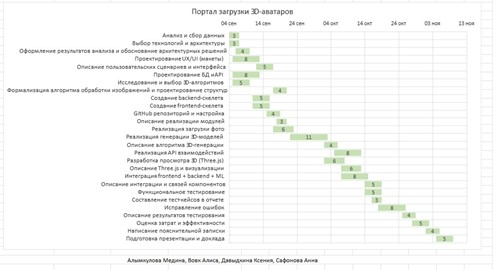
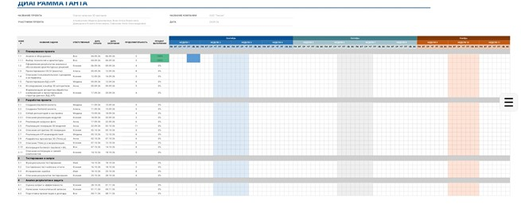

# Техническое задание: Веб-интерфейс для построения 3D-моделей по фото

## 1. Введение

**Цель проекта:** разработать веб-приложение, позволяющее пользователю загрузить фотографию объекта через веб-интерфейс и получить построенную на её основе 3D-модель.

**Основной сценарий работы:** загрузка фотографии → обработка изображения → построение 3D-модели → отображение результата → скачивание модели.

**Основные функции:**
-	загрузка фотографии через веб-интерфейс;
-	проверка формата и размера загружаемого файла;
-	передача фотографии на сервер и её хранение;
- запуск процесса построения 3D-модели;
- отображение статуса обработки;
-	получение и сохранение результата обработки;
-	просмотр 3D-модели непосредственно в браузере;
-	скачивание готовой 3D-модели;
-	обработка ошибок при загрузке и генерации модели;
-	хранение информации о загруженных фотографиях и полученных моделях.

**Целевая аудитория:** пользователи, желающие получить 3D-модель объекта по фотографии; студенты и преподаватели, использующие систему для демонстрации технологий 3D-реконструкции; разработчики, заинтересованные в интеграции технологий компьютерного зрения и 3D-моделирования.

## 2. Требования к системе

### 2.1. Функциональные требования

**Загрузка фотографии**
-	пользователь должен иметь возможность выбрать фотографию с устройства и загрузить её через веб-интерфейс;
-	система должна проверять тип и размер файла;
-	при некорректном файле система должна информировать пользователя об ошибке;
-	загруженное изображение должно сохраняться на сервере.

**Построение 3D-модели**

После успешной загрузки изображения система передаёт его в модуль построения 3D-модели. Модуль выполняет необходимую обработку изображения, формирует 3D-представление объекта, сохраняет результат в поддерживаемом формате и передаёт информацию о результате серверной части.

**Просмотр результата**
-	просмотр полученной 3D-модели непосредственно в браузере;
-	вращение модели;
-	изменение масштаба;
-	осмотр модели с разных сторон.

**Скачивание модели**

Пользователь должен иметь возможность скачать результат обработки в поддерживаемом формате, например .glb или .obj.

### 2.2. Другие требования
-	понятный и простой пользовательский интерфейс;
-	корректная работа в современных браузерах;
-	разделение frontend и backend;
-	наличие API для взаимодействия клиентской и серверной частей;
-	корректная обработка ошибок;
-	сохранность загруженных файлов;
-	понятная структура исходного кода;
-	использование системы контроля версий Git;
- наличие документации по запуску и использованию проекта.

## 3. Архитектура системы

Предполагается использование клиент-серверной архитектуры. Система состоит из пользовательского интерфейса, серверной части, ML/3D-модуля и хранилища файлов и данных.

| Компонент | Назначение |
|---|---|
| Frontend | Загрузка фотографий, отображение статуса обработки, просмотр 3D-модели, скачивание результата. |
| Backend | REST API, обработка запросов, загрузка и хранение файлов, управление процессом генерации, взаимодействие с ML/3D-модулем. |
| ML/3D-модуль | Обработка фотографии, построение 3D-модели, сохранение результата. |
| Хранилище | Хранение исходных фотографий, созданных 3D-моделей и информации о задачах обработки. |

## 4. Необходимые роли в команде проекта

Для реализации проекта формируется команда из четырёх человек.

| Роль | Количество | Описание обязанностей |
|---|---|---|
| Team Lead + Frontend-разработчик | 1 | Общая техническая координация, структура frontend, пользовательский интерфейс, загрузка фотографий, 3D-просмотрщик, интеграция frontend с API. |
| Backend-разработчик | 1 | REST API, серверная логика, загрузка и хранение файлов, взаимодействие с ML-модулем, обработка ошибок. Основная технология серверной части — Python/FastAPI. |
| ML/3D-разработчик | 1 | Исследование алгоритмов, выбор модели, обработка изображений, генерация и экспорт 3D-моделей, проверка качества результатов. |
| QA + DevOps + документация | 1 | Тестирование, настройка окружения, контроль качества, подготовка релиза, ведение документации и отчётности на протяжении всего проекта. |

### 4.1. Участник 1 — Team Lead + Frontend-разработчик
- общая координация технической разработки;
-	структура frontend;
-	проектирование пользовательского интерфейса;
-	реализация страницы загрузки фотографии;
-	отображение статуса обработки;
-	реализация 3D-просмотрщика;
-	взаимодействие frontend с API;
-	интеграция компонентов системы.

### 4.2. Участник 2 — Backend-разработчик
-	разработка серверной части;
-	создание REST API;
-	реализация загрузки и валидации фотографий;
-	хранение фотографий и результатов;
-	взаимодействие с ML/3D-модулем;
-	обработка ошибок;
-	организация структуры backend.

### 4.3. Участник 3 — ML/3D-разработчик
-	исследование существующих методов построения 3D-моделей по фотографии;
-	выбор подходящего алгоритма или готовой модели;
-	подготовка входных изображений;
-	интеграция ML-модуля;
-	генерация 3D-моделей;
-	экспорт результата в необходимый формат;
-	проверка качества получаемых моделей.

### 4.4. Участник 4 — QA + DevOps + документация
Участник 4 отвечает не только за тестирование, но и за постоянное ведение проектной документации. Документация формируется параллельно разработке, а не только перед сдачей.

**Тестирование:**
-	разработка тест-кейсов;
-	функциональное и интеграционное тестирование;
-	проверка загрузки файлов и генерации моделей;
-	проверка отображения 3D-моделей;
-	регрессионное тестирование;
-	фиксация и контроль исправления ошибок.

**DevOps:**
-	настройка репозитория;
-	настройка окружения разработки;
-	контроль зависимостей;
-	настройка базовых средств автоматической проверки проекта;
-	подготовка проекта к запуску и релизу.

**Документация и отчётность:**
-	ведение дневника проекта;
-	сбор информации о ходе разработки у остальных участников;
-	фиксация результатов встреч и технических решений;
-	поддержание актуальности ТЗ;
-	оформление архитектуры, схем и диаграмм;
-	описание реализованных модулей;
-	подготовка инструкций по запуску;
-	формирование тестовой документации;
-	сбор материалов для пояснительной записки;
-	подготовка итоговых материалов к защите.

## 5. Этапы реализации и диаграмма Ганта
Продолжительность проекта — около 10 недель, с 03 сентября по 15 ноября. Работы отдельных участников выполняются параллельно.

### 5.1. Непрерывная документация и отчётность
Параллельно со всеми этапами проекта с 03.09 по 15.11 выполняется непрерывная работа с документацией. Ответственный — участник 4 при участии всех членов команды.
-	сбор результатов работы участников;
-	обновление технического задания;
-	подготовка и актуализация архитектурных схем и диаграмм;
-	описание технологий и реализованных компонентов;
-	ведение тестовой документации;
-	постепенное формирование разделов пояснительной записки;
-	подготовка материалов для презентации и защиты.

## 6. Расшифровка этапов
**Этап 1: Анализ и проектирование (03.09–20.09)**

Определяются требования к системе, пользовательские сценарии, архитектура приложения, используемые технологии и подход к построению 3D-моделей. Результат: ТЗ, выбранный стек, архитектура, макеты интерфейса, предварительная структура API и выбранный подход к построению модели.

**Этап 2: Разработка (18.09–22.10)**

Frontend, backend и ML/3D-модуль разрабатываются параллельно. Frontend реализует интерфейс, backend — API и хранение файлов, ML/3D-разработчик — механизм построения модели. Участник 4 готовит окружение, тестовую документацию и фиксирует результаты.

**Этап 3: Интеграция и отладка (15.10–31.10)**

Отдельные компоненты объединяются в единую систему. Проверяется цепочка Frontend → Backend → ML/3D → Backend → Frontend. Проводится отладка взаимодействия компонентов и исправление критических ошибок.

**Этап 4: Тестирование (30.10–12.11)**

Проводятся smoke-, функциональное, интеграционное, пользовательское и повторное тестирование. Разработчики участвуют в исправлении обнаруженных проблем.

**Этап 5: Финальная подготовка (12.11–15.11)**

Выполняются финальная сборка, проверка основных сценариев, завершение пояснительной записки, оформление документации, подготовка презентации, доклада и демонстрационной версии проекта.

## 7. Результаты проекта
-	веб-интерфейс для загрузки фотографий;
-	серверная часть на Python/FastAPI;
-	API для взаимодействия компонентов;
-	модуль построения 3D-моделей;
-	хранилище исходных фотографий и результатов;
-	3D-просмотрщик в браузере;
-	возможность скачивания полученной модели;
- обработка ошибок;
-	тестовая документация;
-	техническая документация;
-	пояснительная записка;
-	презентация и материалы для защиты.

## 8. Итоговое распределение ответственности
| Участник | Основная зона ответственности |
|---|---|
| 1 — Team Lead + Frontend | Интерфейс, frontend, техническая координация и интеграция клиентской части. |
| 2 — Backend | API, серверная логика, загрузка и хранение файлов, взаимодействие компонентов. |
| 3 — ML/3D | Алгоритм построения 3D-модели, обработка изображений и интеграция ML-модуля. |
| 4 — QA + DevOps + документация | Тестирование, окружение, контроль качества, документация, отчётность и подготовка релиза. |
